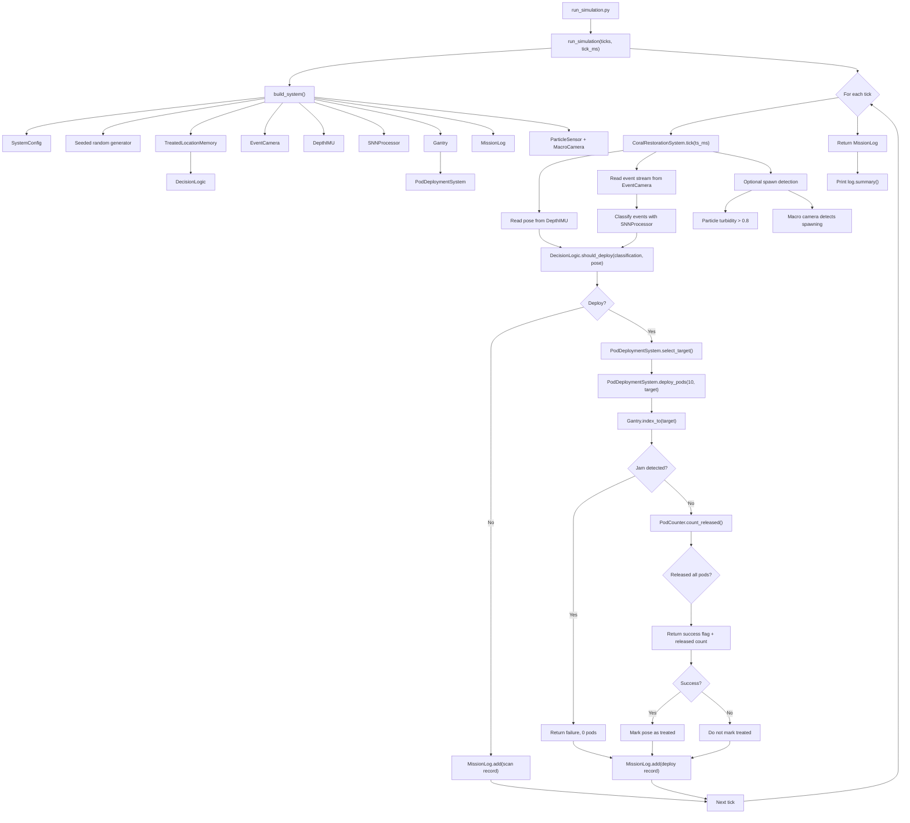
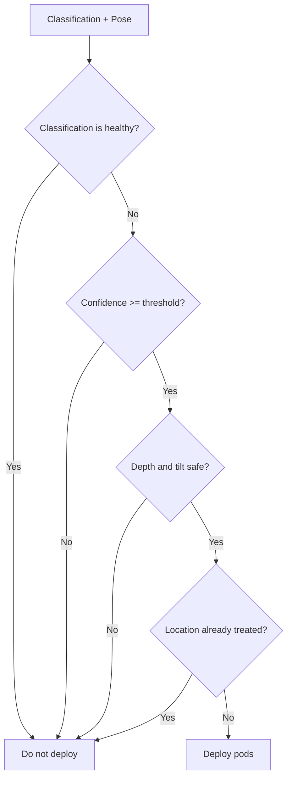
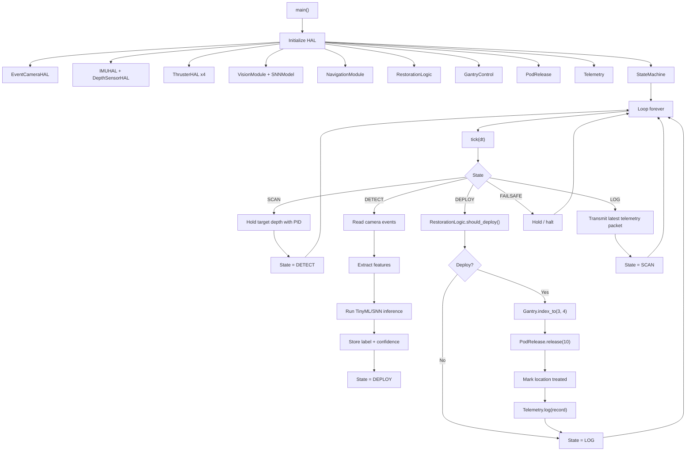
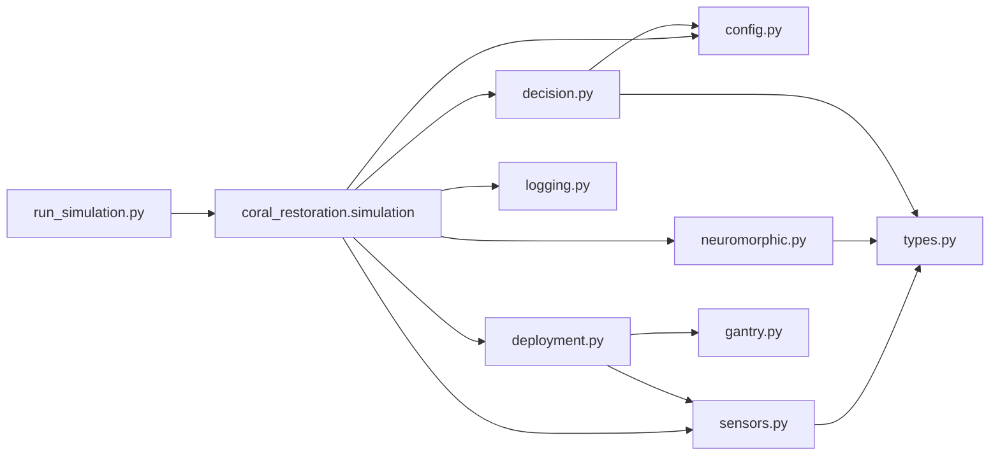

# Codebase Flowchart

## Simulator Pipeline

```mermaid
flowchart TD
    A["run_simulation.py"] --> B["run_simulation(ticks, tick_ms)"]
    B --> C["build_system()"]

    C --> C1["SystemConfig"]
    C --> C2["Seeded random generator"]
    C --> C3["TreatedLocationMemory"]
    C3 --> C4["DecisionLogic"]
    C --> C5["EventCamera"]
    C --> C6["DepthIMU"]
    C --> C7["SNNProcessor"]
    C --> C8["Gantry"]
    C8 --> C9["PodDeploymentSystem"]
    C --> C10["MissionLog"]
    C --> C11["ParticleSensor + MacroCamera"]

    B --> D{"For each tick"}
    D --> E["CoralRestorationSystem.tick(ts_ms)"]
    E --> F["Read pose from DepthIMU"]
    E --> G["Read event stream from EventCamera"]
    G --> H["Classify events with SNNProcessor"]
    E --> I["Optional spawn detection"]
    I --> I1["Particle turbidity > 0.8"]
    I --> I2["Macro camera detects spawning"]

    H --> J["DecisionLogic.should_deploy(classification, pose)"]
    F --> J
    J --> K{"Deploy?"}

    K -- "No" --> L["MissionLog.add(scan record)"]
    K -- "Yes" --> M["PodDeploymentSystem.select_target()"]
    M --> N["PodDeploymentSystem.deploy_pods(10, target)"]
    N --> O["Gantry.index_to(target)"]
    O --> P{"Jam detected?"}
    P -- "Yes" --> Q["Return failure, 0 pods"]
    P -- "No" --> R["PodCounter.count_released()"]
    R --> S{"Released all pods?"}
    S --> T["Return success flag + released count"]
    T --> U{"Success?"}
    U -- "Yes" --> V["Mark pose as treated"]
    U -- "No" --> W["Do not mark treated"]
    V --> X["MissionLog.add(deploy record)"]
    W --> X
    Q --> X

    L --> Y["Next tick"]
    X --> Y
    Y --> D
    D --> Z["Return MissionLog"]
    Z --> AA["Print log.summary()"]
```

## Deployment Decision Gates

```mermaid
flowchart TD
    A["Classification + Pose"] --> B{"Classification is healthy?"}
    B -- "Yes" --> X["Do not deploy"]
    B -- "No" --> C{"Confidence >= threshold?"}
    C -- "No" --> X
    C -- "Yes" --> D{"Depth and tilt safe?"}
    D -- "No" --> X
    D -- "Yes" --> E{"Location already treated?"}
    E -- "Yes" --> X
    E -- "No" --> Y["Deploy pods"]
```

## Firmware State Machine

```mermaid
flowchart TD
    A["main()"] --> B["Initialize HAL"]
    B --> B1["EventCameraHAL"]
    B --> B2["IMUHAL + DepthSensorHAL"]
    B --> B3["ThrusterHAL x4"]
    B --> B4["VisionModule + SNNModel"]
    B --> B5["NavigationModule"]
    B --> B6["RestorationLogic"]
    B --> B7["GantryControl"]
    B --> B8["PodRelease"]
    B --> B9["Telemetry"]
    B --> C["StateMachine"]

    C --> D["Loop forever"]
    D --> E["tick(dt)"]
    E --> F{"State"}

    F -- "SCAN" --> G["Hold target depth with PID"]
    G --> H["State = DETECT"]

    F -- "DETECT" --> I["Read camera events"]
    I --> J["Extract features"]
    J --> K["Run TinyML/SNN inference"]
    K --> L["Store label + confidence"]
    L --> M["State = DEPLOY"]

    F -- "DEPLOY" --> N["RestorationLogic.should_deploy()"]
    N --> O{"Deploy?"}
    O -- "No" --> P["State = LOG"]
    O -- "Yes" --> Q["Gantry.index_to(3, 4)"]
    Q --> R["PodRelease.release(10)"]
    R --> S["Mark location treated"]
    S --> T["Telemetry.log(record)"]
    T --> P

    F -- "LOG" --> U["Transmit latest telemetry packet"]
    U --> V["State = SCAN"]

    F -- "FAILSAFE" --> W["Hold / halt"]

    H --> D
    P --> D
    V --> D
    W --> D
```

## Module Dependency View

```mermaid
flowchart LR
    A["run_simulation.py"] --> B["coral_restoration.simulation"]
    B --> C["config.py"]
    B --> D["sensors.py"]
    B --> E["neuromorphic.py"]
    B --> F["decision.py"]
    B --> G["deployment.py"]
    B --> H["logging.py"]

    D --> I["types.py"]
    E --> I
    F --> C
    F --> I
    G --> J["gantry.py"]
    G --> D
```
