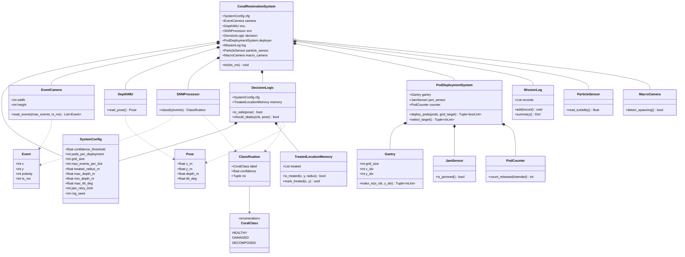
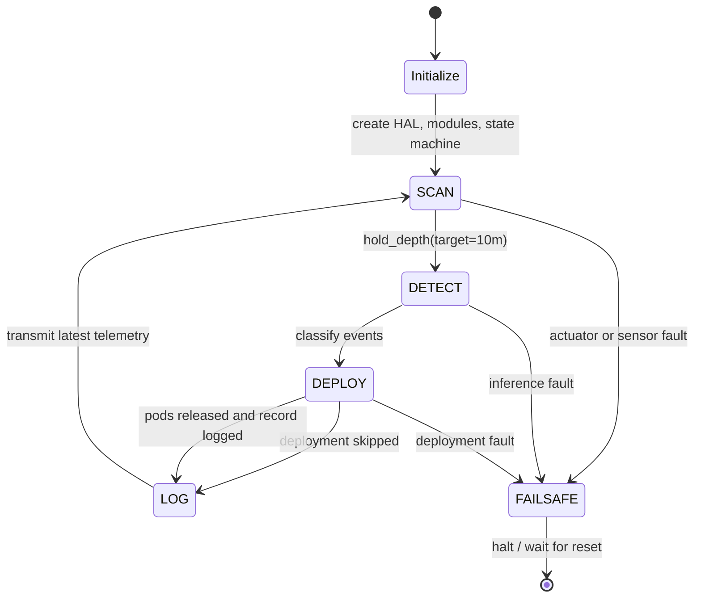
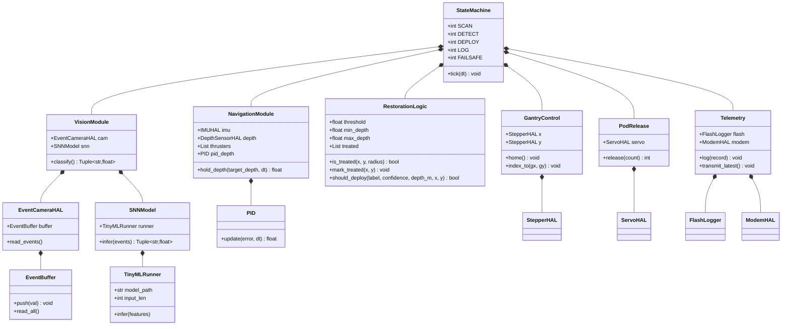

# UML Diagrams

## Simulator Class Diagram

```mermaid
classDiagram
    class CoralRestorationSystem {
        +SystemConfig cfg
        +EventCamera camera
        +DepthIMU imu
        +SNNProcessor snn
        +DecisionLogic decision
        +PodDeploymentSystem deployer
        +MissionLog log
        +ParticleSensor particle_sensor
        +MacroCamera macro_camera
        +tick(ts_ms) void
    }

    class SystemConfig {
        +float confidence_threshold
        +int pods_per_deployment
        +int grid_size
        +int max_events_per_tick
        +float treated_radius_m
        +float max_depth_m
        +float min_depth_m
        +float max_tilt_deg
        +int jam_retry_limit
        +int rng_seed
    }

    class EventCamera {
        +int width
        +int height
        +read_events(max_events, ts_ms) List~Event~
    }

    class DepthIMU {
        +read_pose() Pose
    }

    class ParticleSensor {
        +read_turbidity() float
    }

    class MacroCamera {
        +detect_spawning() bool
    }

    class JamSensor {
        +is_jammed() bool
    }

    class PodCounter {
        +count_released(intended) int
    }

    class SNNProcessor {
        +classify(events) Classification
    }

    class DecisionLogic {
        +SystemConfig cfg
        +TreatedLocationMemory memory
        +is_safe(pose) bool
        +should_deploy(cls, pose) bool
    }

    class TreatedLocationMemory {
        +List treated
        +is_treated(x, y, radius) bool
        +mark_treated(x, y) void
    }

    class PodDeploymentSystem {
        +Gantry gantry
        +JamSensor jam_sensor
        +PodCounter counter
        +deploy_pods(pods, grid_target) Tuple~bool,int~
        +select_target() Tuple~int,int~
    }

    class Gantry {
        +int grid_size
        +int x_idx
        +int y_idx
        +index_to(x_idx, y_idx) Tuple~int,int~
    }

    class MissionLog {
        +List records
        +add(record) void
        +summary() Dict
    }

    class CoralClass {
        <<enumeration>>
        HEALTHY
        DAMAGED
        DECOMPOSED
    }

    class Event {
        +int x
        +int y
        +int polarity
        +int ts_ms
    }

    class Pose {
        +float x_m
        +float y_m
        +float depth_m
        +float tilt_deg
    }

    class Classification {
        +CoralClass label
        +float confidence
        +Tuple roi
    }

    CoralRestorationSystem *-- SystemConfig
    CoralRestorationSystem *-- EventCamera
    CoralRestorationSystem *-- DepthIMU
    CoralRestorationSystem *-- SNNProcessor
    CoralRestorationSystem *-- DecisionLogic
    CoralRestorationSystem *-- PodDeploymentSystem
    CoralRestorationSystem *-- MissionLog
    CoralRestorationSystem o-- ParticleSensor
    CoralRestorationSystem o-- MacroCamera

    DecisionLogic *-- SystemConfig
    DecisionLogic *-- TreatedLocationMemory
    PodDeploymentSystem *-- Gantry
    PodDeploymentSystem *-- JamSensor
    PodDeploymentSystem *-- PodCounter

    EventCamera ..> Event
    DepthIMU ..> Pose
    SNNProcessor ..> Event
    SNNProcessor ..> Classification
    Classification --> CoralClass
    DecisionLogic ..> Classification
    DecisionLogic ..> Pose
```

## Firmware State Diagram

```mermaid
stateDiagram-v2
    [*] --> Initialize
    Initialize --> SCAN: create HAL, modules, state machine

    SCAN --> DETECT: hold_depth(target=10m)
    DETECT --> DEPLOY: classify events
    DEPLOY --> LOG: deployment skipped
    DEPLOY --> LOG: pods released and record logged
    LOG --> SCAN: transmit latest telemetry

    SCAN --> FAILSAFE: actuator or sensor fault
    DETECT --> FAILSAFE: inference fault
    DEPLOY --> FAILSAFE: deployment fault
    FAILSAFE --> [*]: halt / wait for reset
```

## Firmware Class Diagram

```mermaid
classDiagram
    class StateMachine {
        +int SCAN
        +int DETECT
        +int DEPLOY
        +int LOG
        +int FAILSAFE
        +tick(dt) void
    }

    class VisionModule {
        +EventCameraHAL cam
        +SNNModel snn
        +classify() Tuple~str,float~
    }

    class SNNModel {
        +TinyMLRunner runner
        +infer(events) Tuple~str,float~
    }

    class TinyMLRunner {
        +str model_path
        +int input_len
        +infer(features)
    }

    class NavigationModule {
        +IMUHAL imu
        +DepthSensorHAL depth
        +List thrusters
        +PID pid_depth
        +hold_depth(target_depth, dt) float
    }

    class RestorationLogic {
        +float threshold
        +float min_depth
        +float max_depth
        +List treated
        +is_treated(x, y, radius) bool
        +mark_treated(x, y) void
        +should_deploy(label, confidence, depth_m, x, y) bool
    }

    class GantryControl {
        +StepperHAL x
        +StepperHAL y
        +home() void
        +index_to(gx, gy) void
    }

    class PodRelease {
        +ServoHAL servo
        +release(count) int
    }

    class Telemetry {
        +FlashLogger flash
        +ModemHAL modem
        +log(record) void
        +transmit_latest() void
    }

    class EventCameraHAL {
        +EventBuffer buffer
        +read_events()
    }

    class EventBuffer {
        +push(val) void
        +read_all()
    }

    class PID {
        +update(error, dt) float
    }

    StateMachine *-- VisionModule
    StateMachine *-- NavigationModule
    StateMachine *-- RestorationLogic
    StateMachine *-- GantryControl
    StateMachine *-- PodRelease
    StateMachine *-- Telemetry

    VisionModule *-- EventCameraHAL
    VisionModule *-- SNNModel
    SNNModel *-- TinyMLRunner
    NavigationModule *-- PID
    GantryControl *-- StepperHAL
    PodRelease *-- ServoHAL
    Telemetry *-- FlashLogger
    Telemetry *-- ModemHAL
    EventCameraHAL *-- EventBuffer
```
